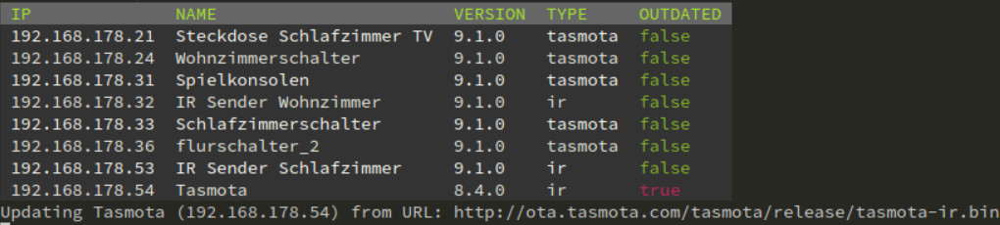

# Tasmogo – a self contained auto-updater for Tasmota devices

Tasmogo is a simple Golang app that runs inside a Docker container and will automatically update all your [Tasmota](https://github.com/arendst/Tasmota) devices. It will respect build variants like `sensors` oder language variants like `DE` when updating.

This tool is just meant to provide automatic updates. For a real management solution have a look at [Tasmo-Admin](https://github.com/reloxx13/TasmoAdmin).

## Usage

You can run build the binary yourself using `go build` or use the provided [Docker image](https://hub.docker.com/repository/docker/merlinschumacher/tasmogo).

To configure tasmogos behaviour set the following environment variables:

`TASMOGO_CIDR` – Set the network CIDR that is to be scanned for Tasmota devices (`192.168.0.0/24`)

`TASMOGO_DOUPDATES` – Update devices if neccessary (`false`)

`TASMOGO_OTAURL` – Set the URL from where the updates are pulled (`http://ota.tasmota.com/tasmota/release/`)

`TASMOGO_PASSWORD` – Define a password for the devices WebUI, if not set, no authentication is used. (``)

`TASMOGO_DAEMON` – Start tasmogo as a daemon that checks for updates every 24h. (`false`)
